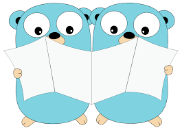

    

<h1 align="center">
  Learning Go
</h1>

## Index

Several folders with complete challenges

- challenge_1: full app exposing endpoints, connecting to a postgres db and consuming/producing kafka messages

- challenge_docker: dockerize a go app

- challenge_fizzbuzz: go fizzbuzz algorithm

