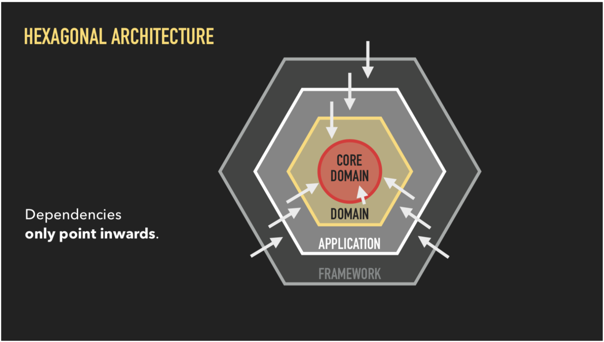
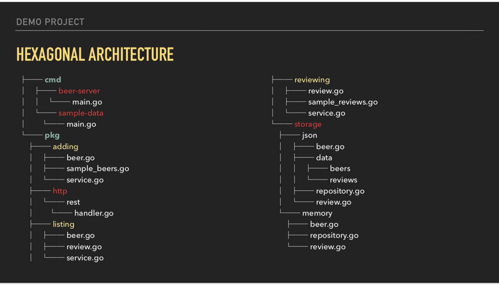

## **Domain Driven Development**

Domain driven development works by first establishing your domain and business logic. It makes you think about the domain you’re dealing with and the business logic in your app before you even write a single line of code. Next, you’ll define bounded contexts which help you decide what has to be consistent and what can develop independently.

We can use the demo project to better understand each of the building blocks of the system:

- Context: beer tasting.
    - Drinking the beer and wanting to review it has a specific meaning. It may have ABV that matters whereas the barcode does not matter. If we had an additional context like a beer manufacturer they would care about the barcode.
- Language: beer, review, storage
    - It’s important to define the language used in the codebase. All stakeholders should know they can use. Developers, customer service, or the sales team.
- Entities: Beer, review
    - Entities are an abstract concept that can then have instances. A customer, an order, a blog post are all entities that can be instantiated.
- Value Objects: Brewery, Author
    - Value Objects represents a part of an entity - much more like properties.
- Aggregates: BeerReview
    - The BeerReview aggregate is the composition of two entities that cannot exist by themselves. A beer review requires beer and a review.
- Service: Beer adder / adding, review adder, beer lister, review lister.
- Events: Beer added, review added, beer already exists, beer not found.
    - Capture something interesting that happened in the application.
- Repository: Beer repository, review repository
    - Provides a facade over some backing store that exists between the domain logic and the application storage.

These building blocks result in a new type of structure: [Group by Context](https://sourcegraph.com/github.com/katzien/go-structure-examples@master/-/tree/domain)

In the real world you could be dealing with this type of complexity so this is a perfect example that takes a very academic concept and makes a fully functional application out of it.

## **Hexagonal Architecture**

Hexagonal architecture helps achieve the goal of being able to easily change one part of the application without having to rewrite the entire thing. The key rule in the hex model is that dependencies are only allowed to point inwards.

The outer layer in the hex model can reach out to the domain as much as they like, but the domain cannot reference anything outside of it. This implies a heavy use of interfaces and Inversion of Control, and we define interfaces at every boundary to abstract away the details for each layer.

- Core domain will define the business logic in abstract term.
- Then the rest of the application which implements the core domain functionality will define their own storage functionality that they need from 3rd parties.
- The particular storage implementation will have to satisfy that interface.
- This means that as long as the interface required by the inner layer is satisfied, we can swap the outer layer implementations easily.

In the demo application we end up with the following architecture:

A huge benefit of this structure that becomes more visible in larger projects, is how it is very easy to extend it’s functionality without affecting multiple parts of the codebase. For example, you want to create an RPC version of the API. You would add it to the **`pkg`** directory and implement the interfaces.